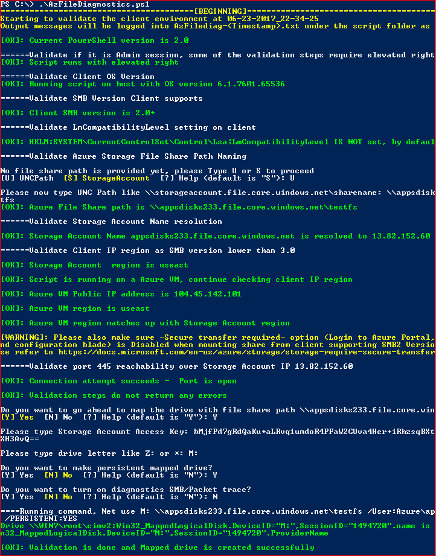

#  AzFileDiagnostics and SmbClientLogs scripts for Windows

The AzFileDiagnostics script automates detection of most of the common symptoms mentioned in the [Azure Files troubleshooting guide](https://docs.microsoft.com/azure/storage/files/storage-troubleshoot-windows-file-connection-problems) and mounts the file share on the client machine. 

The SmbClientLogs script will collect SMB logs and a network trace on the client machine. Use this script if you're unable to mount the Azure file share (and AzFileDiagnostics did not identify the cause) or you experience an SMB issue after the Azure file share is mounted.  

## How to download the PowerShell scripts

- Go to: https://github.com/Azure-Samples/azure-files-samples
- Click **Code** and then click **Download ZIP.**
- Open the **azure-files-samples-master.zip** file and the scripts are located in the **AzFileDiagnostics\Windows** directory.

## How to run the AzFileDiagnostics script

**Note:** To run the AzFileDiagnostics script, launch PowerShell as an administrator. 

The script can run without any parameter and it will perform basic validations without needing storage account information:

```powershell
.\AzFileDiagnostics.ps1
```

Alternatively, you can specify optional parameters when running the script if you wish to perform validations against a specific storage account:

**Example 1: To run the AzFileDiagnostics by UNC path.**

```powershell
.\AzFileDiagnostics.ps1 -UNCPath \\storageaccountname.file.core.windows.net\sharename
```

**Example 2: To run the AzFileDiagnostics by file share name.**

```powershell
.\AzFileDiagnostics.ps1 -StorageAccountName <name> -FileShareName <name> -Environmentname AzureCloud
```

**Note:** Environmentname specifies the Azure environment. Valid values are: AzureCloud, AzureChinaCloud, AzureUSGovernment. The default is AzureCloud.

### Parameters

| Parameter | Description |
|-|-|
| -UNCPath | Azure file share UNC path like storageaccount.file.core.windows.net\sharename. |
| -StorageAccountName | Storage account name where the Azure file share is located. Script will validate the storage naming convention. |
| -FileShareName | Specify the file share name and script will validate the file share name convention. |
| -Environmentname | Specifies the Azure environment. Valid values are AzureCloud, AzureChinaCloud, AzureUSGovernment. The default is AzureCloud. |

### Validations Preformed

- OS version: Verify OS version is Windows 7, Windows Server 2008 R2 or later. 

- SMB version: Verify client supports SMB version 2.1 or 3.0.   

- Hotfix KB3114025: For Windows 8.1 or Windows Server 2012 R2 clients, verify hotfix KB3114025 is installed.

- NTLM: Verify LmCompatibilityLevel registy setting is set to a value of 3. NTLMv1 is not supported.

- Storage account: Verify the storage account name or UNC path exists.

- Azure VM: If client is using SMB 2.x, verify client is Azure VM in the same region as storage account.

- Port 445: When mounting the Azure file share, verify TCP port 445 is not blocked.

- Firewall: Verify local firewall rules are not blocking connectivity to Azure file share.

- If all validations pass, map the drive on behalf of the user. User can also choose turn on the diagnostics to collect more logs.

### Sample Output

  

## How to run the SmbClientLogs script

**Note: To run the SmbClientLogs script, launch PowerShell as an administrator and navigate to the directory where the script is located.** 

When you run the script, you must specify a parameter. SMB logs are always collected and to collect a network trace, you must use the -CaptureNetwork parameter. The script can also be configured to stop log and trace collection when an anomaly is detected (error in the event log, unexpected SMB status code, high latency, high credit stall). See more details in the parameters section. 

**Example 1: If the issue can be easily reproduced, perform the following steps to capture the SMB logs:**

- Run the following PowerShell command to start collecting the SMB logs:
```powershell
.\SmbClientLogs.ps1 -Start
```
- Reproduce the issue. 
- Run the following PowerShell command to stop collecting the SMB logs:
```powershell
.\SmbClientLogs.ps1 -Stop
```
- The output file (.zip) with the SMB logs will be generated in the output directory (default is C:\Windows\System32 directory). To use a different output directory, use the -OutputDirectory parameter.
 
**Example 2: If the issue can be easily reproduced, perform the following steps to capture the SMB logs and network trace:**

- Run the following PowerShell command to start collecting the SMB logs and network trace:
```powershell
.\SmbClientLogs.ps1 -Start -CaptureNetwork
```
- Reproduce the issue. 
- Run the following command to stop collecting the SMB logs and network trace:
```powershell
.\SmbClientLogs.ps1 -Stop
```
- The output file (.zip) with the SMB logs and network trace will be generated in the output directory (default is C:\Windows\System32 directory). To use a different output directory, use the -OutputDirectory parameter.

**Example 3: If the issue cannot be easily reproduced, perform the following steps to stop the SMB logs when any anomaly is detected:**

- Run the following PowerShell command:
```powershell
.\SmbClientLogs.ps1 -OnAnomaly
```
- The output file (.zip) with the SMB logs and network trace will be generated in the output directory (default is C:\Windows\System32 directory). To use a different output directory, use the -OutputDirectory parameter.

**Example 4: If the issue cannot be easily reproduced, perform the following steps to stop the SMB log and network trace when any anomaly is detected:**

- Run the following PowerShell command:
```powershell
.\SmbClientLogs.ps1 -OnAnomaly -CaptureNetwork
```
- The output file (.zip) with the SMB logs and network trace will be generated in the output directory (default is C:\Windows\System32 directory). To use a different output directory, use the -OutputDirectory parameter.

**Example 5: Stop SMB log collection and network trace when a connectivity error occurs:**

- Run the following PowerShell command:
```powershell
.\SmbClientLogs.ps1 -OnConnectivityError -CaptureNetwork -IncludeTcpLogs
```
- The output file (.zip) with the SMB logs and network trace will be generated in the output directory (default is C:\Windows\System32 directory). To use a different output directory, use the -OutputDirectory parameter.

**Example 6: Stop SMB log collection and network trace when a connectivity Event ID 30809 is logged:**

- Run the following PowerShell command:
```powershell
.\SmbClientLogs.ps1 -OnConnectivityEventId 30809 -IncludeTcpLogs -CaptureNetwork
```
- The output file (.zip) with the SMB logs and network trace will be generated in the output directory (default is C:\Windows\System32 directory). To use a different output directory, use the -OutputDirectory parameter.

### Parameters

**Common Parameters**

| Parameter | Description |
|-|-|
| -Start | Stop logs and trace collection. |
| -Stop | Stop logs and trace collection. |
| -TempDirectory | Temporary directory for logs and network trace. |
| -OutputDirectory | Directory where the output file (.zip) is generated. |
| -MaxOutputFiles | Maximum number of log files kept in the output directory. |
| -IncludeTcpLogs | Include tcp.etl trace file. |
| -DetailedSmbTracing | Verbose tracing. |
| -CaptureNetwork | Capture network trace. |
| -NetworkAddress | Limit network trace to specific IP address. |
| -NetworkBufferSizeMB | Buffer size for network trace. |

**Anomaly Parameters**

When any of the following parameters are specified, SMB logs and network trace collection will stop once the condition is met.

| Parameter | Description |
|-|-|
| -OnAnomaly | Any error is logged in the SMBClient/Connectivity, SMBClient/Operational, SMBClient/Security event logs. |
| -OnConnectivityError | Any error is logged in the SMBClient/Connectivity event log. |
| -OnConnectivityEventId | Event ID specified is logged in the SMBClient/Connectivity event log. |
| -OnOperationalError | Any error is logged in the SMBClient/Operational event log. |
| -OnOperationalEventId | Event ID specified is logged in the SMBClient/Operational event log. |
| -OnSecurityError | Any error is logged in the SMBClient/Security event log. |
| -OnSecurityEventId | Event ID specified is logged in the SMBClient/Security event log. |
| -HighAvgIOLatencyMs | Averagy latency for one second exceeds the ms threshold specified. |
| -HighLatencyMs | Latency for any operation exceeds the ms threshold specified. |
| -CreditStallThreshold | Credit stalls exceed the threshold specified. |
| -StatusCodes | Status code specific (for example, 0x2, 0x3) is returned. |

**Note**: To continue collecting logs once an anomaly is detected, use the -Continuous parameter. An output file (.zip file) will be generated for each anomaly detected. To stop SMB logs and network trace collection, use CTRL+C and then run the ".\SmbClientLogs.ps1 -Stop" PowerShell command.

For the complete list of parameters, run the SmbClientLogs.ps1 with no parameters.

## Disclaimer

The sample scripts are not supported under any Microsoft standard support program or service. The sample scripts are provided AS IS without warranty of any kind. Microsoft further disclaims all implied warranties including, without limitation, any implied warranties of merchantability or of fitness for a particular purpose. The entire risk arising out of the use or performance of the sample scripts and documentation remains with you. In no event shall Microsoft, its authors, or anyone else involved in the creation, production, or delivery of the scripts be liable for any damages whatsoever (including, without limitation, damages for loss of business profits, business interruption, loss of business information, or other pecuniary loss) arising out of the use of or inability to use the sample scripts or documentation, even if Microsoft has been advised of the possibility of such damages.
