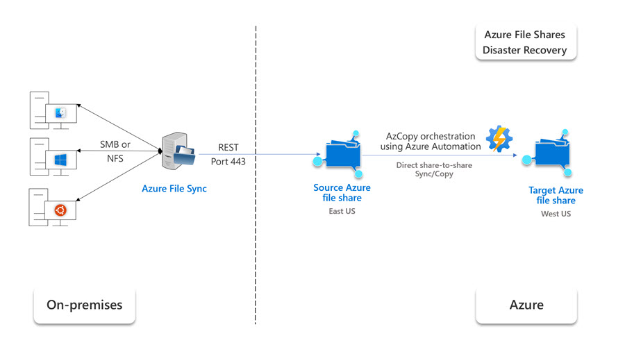

# Sync between two Azure file shares for Backup and Disaster Recovery 

Many Azure Files customers wish to back up their data in another storage account to be able to recover from unintended changes or deletions to their file systems. This solution will enable you to create your own easy backup solution that automatically creates incremental backups of an Azure Files system on a customer-defined schedule and stores the backups in a separate storage account. In particular, it enables customers to achieve geographic redundancy for their backups. This webpage provides an overview of the Azure Files AzCopy based backup solution's design and functionality.

For full details on how to automate this solution, read the following blog post by Microsoft MVP Charbel Nemnom: [Sync between Two Azure File Shares for Disaster Recovery](https://charbelnemnom.com/sync-between-two-azure-file-shares-for-disaster-recovery/).

## Solution overview

This solution utilizes AzCopy - an purpose-built tool optimized for Azure Storage data movement needs. AzCopy is a command-line utility that you can use to copy blobs or files to or from a storage account. This solution copies snapshots from one file share to the other to ensure fast backups with minimal space overhead. It uses the sync parameter, which is similar to Robocopy /MIR.  Only changes will be at copied with every backup, and any deletions on the source will be mirrored on the target. The copy happens on the server-side, ensuring that it is fast and has minimal egress. This solution utilizes familiar technologies like Windows Task Scheduler and PowerShell, making it easy to maintain without spending time on ramp-up.

The solution works as follows:
1. Snapshot source share.
2. Copy snapshot just taken to the target share using azcopy --sync. AzCopy sync will only transfer new files or files that have changed, and will also remove deleted files from target.
3. Snapshot target share. Result is both snapshots are the same. 
4. The script automatically removes your oldest manual snapshot from both source and target when you are close to the Azure Files snapshot limit (currently 200), ensuring both the script and your scheduled backup jobs never fail.
5. You can automate these steps using Azure Automation (see [Sync between Two Azure File Shares for Disaster Recovery]("www.charbelnemnom.com/sync-between-two-azure-file-shares-for-disaster-recovery") for more details). 

## Requirements
* Azure subscription
* Two different storage accounts, each containing an Azure file share
* AzCopy version 10.8 or later

## Advantages
* Space efficiency
* Cost Efficiency
* Familiar tooling

## Limitations
* There has not been exhausive perf testing done.
* This solution works best on low churn datasets and/or datasets with fewer files and folders (the copy rate is less defined by the data size than the number of files and folders being copied over).
  * During initial perf testing (for a premium file share with 30TB of provisioned capacity), it was observed that a 1TB dataset consisting of 100GB files took about 30 minutes to copy to an empty secondary share.
  * Another 1TB dataset (also for a premium file share with 30TB of provisioned capacity) consisting of many small files averaging 0.005GB each took 3 hours to copy to an empty secondary share.
  * After the initial copy to an empty secondary share, the copy time will vary based on the amount of churn, as only changes are copied over.
  * Datasets with more than 50 million files will experience significantly worse performance.
* AzCopy currently does not allow ACLs to be set on the root of the share.
* If an attribute or ACL is changed on the root (meaning all files and directories underneath the root inherit this attribute), all of the data rather than simply the metadata will be recopied to the target share.
* There is no CSS support on this solution.

## Contributions
* This is an open-source community maintained project and we welcome direct contributions to this project.
